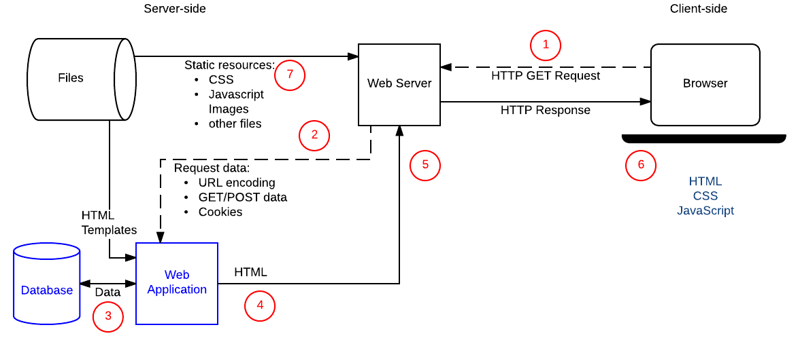

Today I started Odin's [Node-js course](https://www.theodinproject.com/courses/nodejs). My company is very enthusiastic about self training and propose a curated list of courses to learn and practice different technologies. I choose NodeJS because as I'm already proficient with JS, I will be able to give more focus on good practice than syntax details.

Here I will log my learnings through it. The incentives to make it public are:

- Defeat timidity! I'm not used to publicly posting on the web and doing so is already a big step for me!
- [Learn by teaching](https://en.wikipedia.org/wiki/Learning_by_teaching#:~:text=In%20the%20field%20of%20pedagogy,along%20with%20the%20subject%20matter.): trying to re-explain what's just digested may benefit the memorization.

Let's dive in 🤿 !

# Introduction

- NodeJS exist since **2009**.
- It's a **JavaScript runtime**: it runs on a local machine, contrary to JavaScript that runs in a browser. in the background I guess Node is running in a virtual machine as JS does in the browser.
- It's **asynchronous event driven**: the lines of code won't necessarily execute in order. Instead, we write functions that gets called by events such as network request or callbacks

# Event Driven

Let's say I want an app that tell me if I forgot my umbrella. The steps are:

1. fetch the weather forecast
2. if it's sunny, stop
3. check in my database "backpack" if I already got the umbrella
4. If I got it, stop
5. Remind me to take the umbrella

There's two asynchronous process here: fetching the forecast and checking the DB. If I run the steps one by one the program will work. However, we can make it quicker by executing several actions at the same time:

1. fetch the forecast THEN if it's sunny, stop
2. check the database THEN if umbrella is there, stop
3. THEN is it's not sunny, and if I don't have the umbrella, remind me to take it

That way, we stop the program (or pass to the next action) as soon as we got the first response from the forecast or DB. While both actions are running (fetch & query), node waits on an **event**, here the completion of fetch/query. This process is close to the usage of `addEventListener` in frontend, but instead of waiting for mouse click, our events will mostly be network requests and DB query.

To handle events, we'll use [callbacks](https://briggs.dev/blog/understanding-callbacks).

> A callback is a function pass to another function as argument.

Many fonctions uses callback, even `map` and `forEach` : `[1, 2, 3].forEach(n => console.log(n)`. Event listeners uses callback the same way: `element.addEventListener('click', console.log)`.

Here's an exemple of callback usage in NodeJS:

```js
http
  .createServer((req, res) => {
    res.writeHead(200, { 'Content-Type': 'text/html' });
    res.end('Hello Node!');
  })
  .listen(8080);
```

# Assignment: Read & Watch

## NodeJS website

[nodejs.org](https://developer.mozilla.org/en-US/docs/Learn/Server-side/First_steps)

#### Blocking vs not-blocking

During my navigation of the site, I encountered [blocking vs non blocking](https://nodejs.org/en/docs/guides/blocking-vs-non-blocking/) page that triggered my curiosity because it mentions methods whose names end with `Sync`. That might be in relationship with the "Event Driven" section above, so I kept on reading:

_Blocking methods execute synchronously and non-blocking methods execute asynchronously._

```js
const fs = require('fs');
const data = fs.readFileSync('/file.md'); // 1. blocks the process until the file is read
console.log(data); // 2. called after data read
nextMethod(); // 3. called after console.log

fs.readFile('/file.md', (err, data) => {
  // 1. async method, do not block the process !
  if (err) throw err;
  console.log(data); // 3. console when 1. resolved
});
nextMethod(); // 2. called without waiting completion of 1.
```

**Blocking methods** execute synchronously and will block the execution until resolved. If there is an error, the error need to be caught, or the process will crash.
**Non-Blocking methods** execute asynchronously and will not block the execution. Usually a callback can be passed to execute others operation after resolution.


NodeJS is **single threaded**, therefore concurrent process refers to the event loop. Let's consider a server receiving multiple requests, and the request handler performing timely I/O operation on a database. Using blocking methods would handle the request one by one, delaying resolution of later requests. Using non-blocking methods however will let the server handle others requests while the I/O operation are in progress. This may lead to huge performance difference.

Beware of mixing sync and async methods ! The next exemple will cause errors:

```js
fs.readFile('/file.md', (err, data) => {
  // 1. start reading file.md
  if (err) throw err; // 3. crash ! can't read data as the file has been deleted whild reading it.
  console.log(data);
});
fs.unlinkSync('/file.md'); // 2. delete file.md
```

Placing non-blocking call inside callback guarantees a safer order of operations:

```js
fs.readFile('/file.md', (err, data) => {
  // 1. start reading file.md
  if (err) throw err;
  console.log(data); // 2. log data
  fs.unlink('/file.md', err => {
    // 3. start removing file
    if (err) throw err; // handle error if necessary
  });
});
```

## MDN server-side introduction

[MDN](https://developer.mozilla.org/en-US/docs/Learn/Server-side/First_steps)

#### HTTP

Http is the protocol used to transfer hypertext (linked web documents) between two computers (client & server). It is **textual** (all commands are plain text ad human readable) and **stateless**: Neither the client not the server keeps states of the previous exchanges. Only clients can make an HTTP request, and the server can respond to it. Servers _must_ answer every http request, at least with an error message!

#### Static vs Dynamic

A static site always deliver the same content whenever a ressource is requested. Gatsby's sites are static: they're build and stored in the server, then sent as it is.

Dynamic sites are generated on-demand, usually inserting data from a DB into a template. The server can adapt the content based on user preferences sent in the request or already stored in a DB.



#### Benefits

**Efficient storage and delivery**: storing large amount of data like amazon's products or facebook posts will be way more efficient in a database than in individual webpages. A server can access this database and return constructed web pages (html) or data (json). ex: Amazon result's and product's pages.

**Customize user experience**: the server can store user's information like credit cards detail, search history or habits. ex: google auto-complete uses previous search.

**Control access**: control who can view, edit, delete... information. This can be the user but also other servers. ex: bank website needs you to be logged to view your account information or edit your password. The bank itself can edit your accounts balance.

**Store session/state information**: the server can _remember_ the current user of a site and adapt it's response. ex: a newspaper asking you to subscribe after n pages views.

**Notification & communication**: servers can send emails, sms, push notifications... but also live messaging and video conversations.

**Data analysis**: we may collect lot of data about our user and use them. ex: facebook news feed or advertising.

#### Web Frameworks

Framework handles common operations we often need to repeat for apps:

Easily **Mapping urls** for ressources/pages to handler functions:

```python
from django.conf.urls import url
from . import views

urlpatterns = [
   url(r'^$', views.index),         # example: /best/
   url(r'^junior/$', views.junior), # example: /best/junior/
]
```

Filling html **templates** with filtered **data from model**:

```python
from django.shortcuts import render
from .models import Team

def junior(request):
    list_teams = Team.objects.filter(team_type__exact="junior")
    context = {'list': list_teams}
    return render(request, 'best/index.html', context)
```

**[Express](http://expressjs.com/)** is an extremely popular node framework. It is fast, unopinionated, flexible, providing utilities for web apps and http requests. It is minimalist: some functionalities (DB access, user restrictions) might be loaded from libraries or others frameworks based on express.

**[Deno](https://deno.land/)** is a simple, modern and secure JS/TS runtime and framework build with V8 and Rust. It tries to fix some problems with node: security, formating, modules versions.

## Freecodecamp introduction to Node

Freecodecamp [article](https://www.freecodecamp.org/news/what-exactly-is-node-js-ae36e97449f5/) and the linked video explaining clearly (!) the event loop:



The speaker uses a tool he creates to display the current state of call stack, web apis, callback queue and render queue: [Loupe](http://latentflip.com/loupe/)

[This](https://blog.sessionstack.com/how-javascript-works-event-loop-and-the-rise-of-async-programming-5-ways-to-better-coding-with-2f077c4438b5) is a more in depth article about event loop and asynchronous execution.

## Exemple of application

[7 things](https://blog.teamtreehouse.com/7-awesome-things-can-build-node-js) I can build with NodeJS. Those are all interesting and real projects:

- [Gif chat room](https://chat.meatspac.es/) :D
- [Remote control a car](https://github.com/chalkers/extremely_remote_controlled_car)
- We play pokemon (as twitch does !)
- Remote control computer
- Build a hangout-like website
- Collaborative drawing tool
- Desktop RSS reader

# Conclusion

Odin course start with the elementary notions. As I'm self trained and did not have CS academic, my learning sometimes jumped back and forth in complexity. Now I'm very happy to review the ordered basics!
